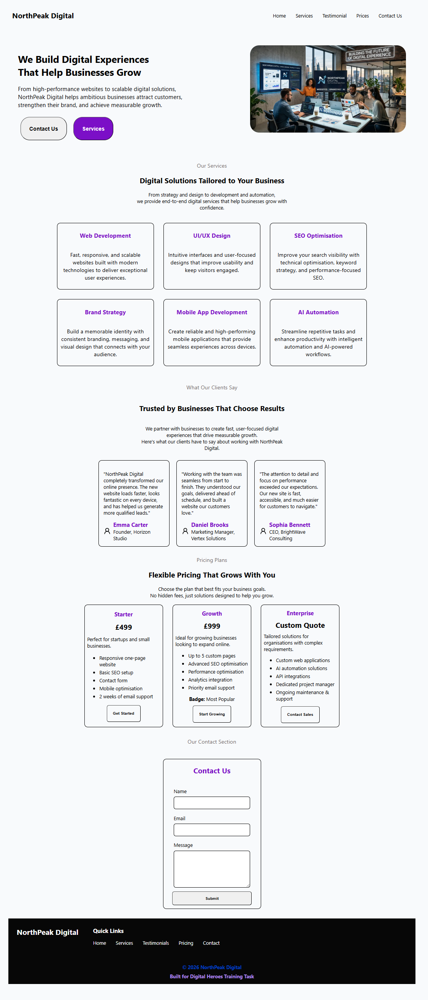
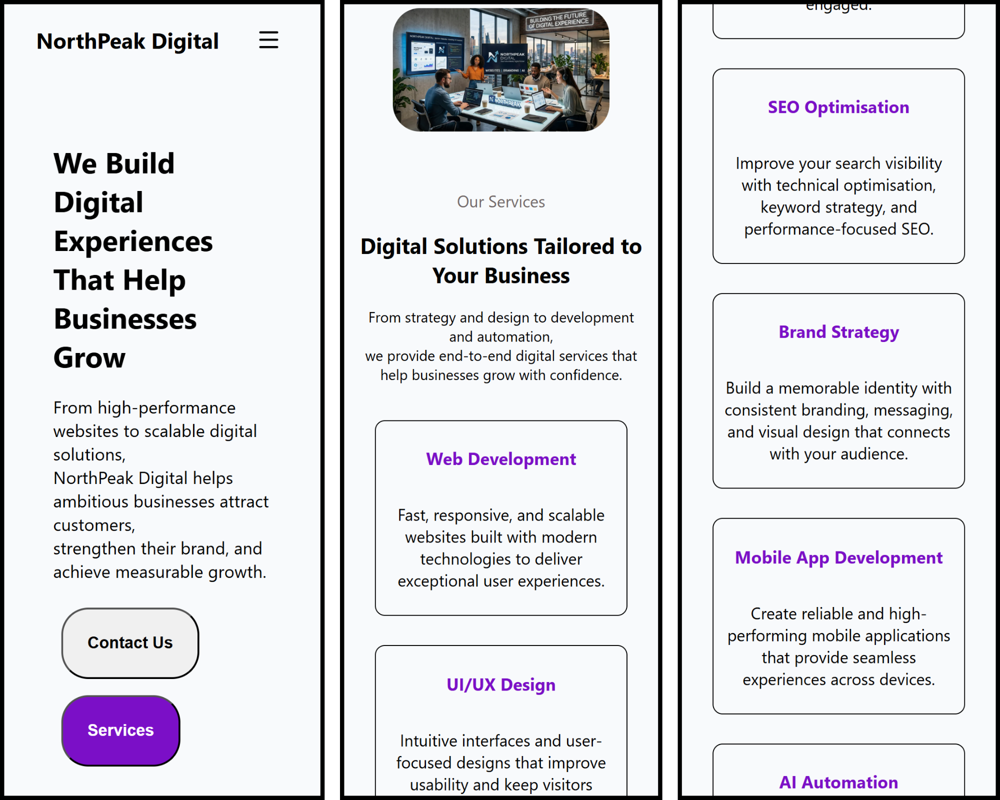
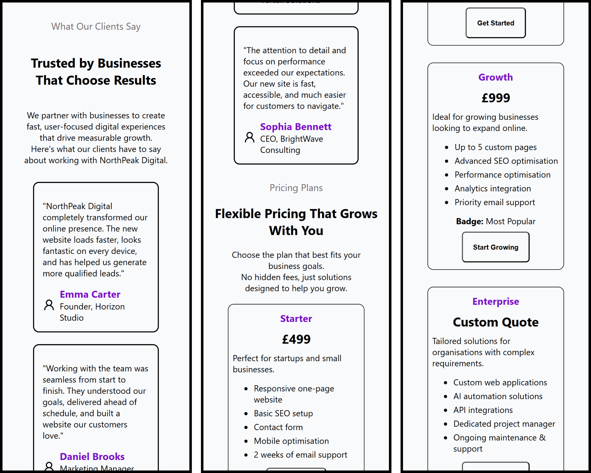
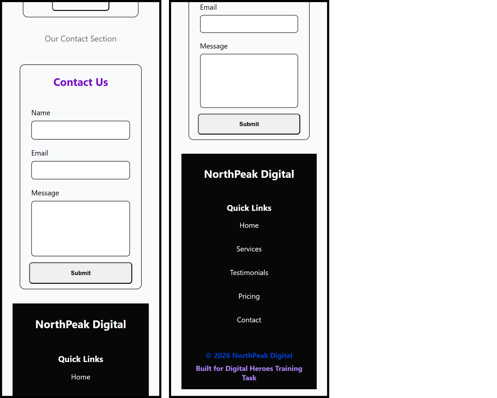
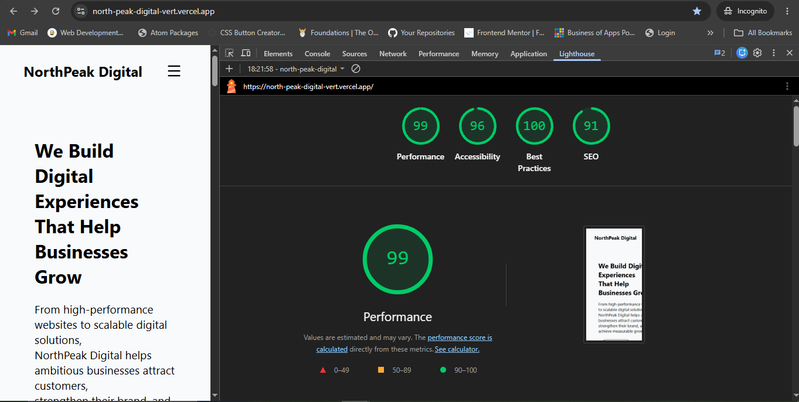
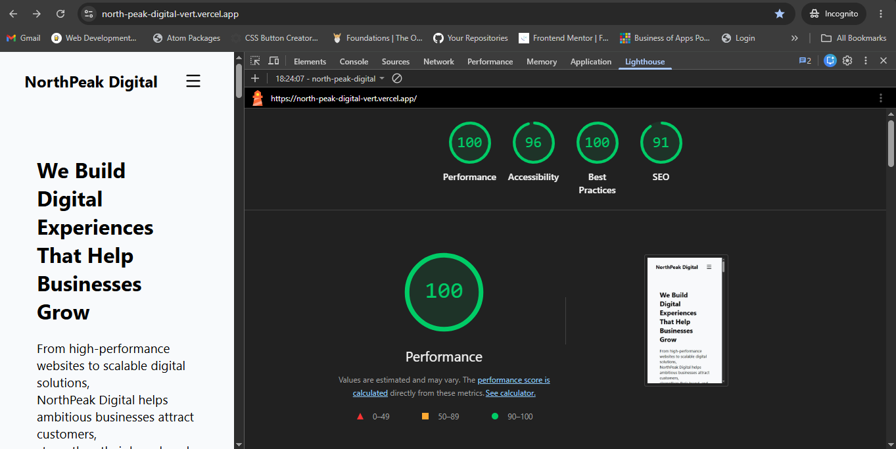

# NorthPeak Digital Landing Page

A responsive landing page for **NorthPeak Digital**, a company that provides modern websites, branding, and AI-powered solutions for startups and small businesses.

> **Note:** This project was developed as part of a web development assignment for **Digital Heroes**.

## Project Overview

The landing page showcases NorthPeak Digital's services and brand identity through a clean, responsive interface. It is built using semantic HTML, CSS, and vanilla JavaScript, with a focus on responsive design, accessibility, and performance.

---

## Features

* Fully responsive layout for mobile, tablet, and desktop devices
* Modern hero section with clear call-to-action
* Services section highlighting company offerings
* Client showcase
* Mobile navigation menu
* Semantic HTML structure

---

## Tech Stack

* HTML5
* CSS3
* JavaScript
* Flexbox

---

## Project Structure

```text
.
├── icons/
│   ├── client.svg
│   ├── cross.svg
│   ├── hero.svg
│   ├── heroImage.webp
│   ├── menu.svg
│   └── favicon.ico
├── screenshots/
│   ├── desktop.png
│   ├── mobile.png
│   └── lighthouse.png
├── index.html
├── style.css
├── script.js
├── README.md
└── CHANGELOG.md
```

---

## Responsive Design

The website has been designed and tested for the following viewport widths:

| Device  | Width  |
| ------- | ------ |
| Mobile  | 360px  |
| Tablet  | 768px  |
| Desktop | 1440px |

The layout uses Flexbox and media queries to ensure a consistent experience across different screen sizes.

---

## Accessibility

Accessibility improvements include:

* Semantic HTML elements
* ARIA attributes for the mobile navigation
* Keyboard-friendly navigation
* Proper heading hierarchy

---

## Performance

Performance optimizations include:

* Optimized WebP images
* Lightweight vanilla JavaScript
* No external UI libraries
* Efficient CSS layout techniques

---

## Screenshots

### Desktop



### Mobile







### Lighthouse Report





---

## Run Locally

1. Download or clone the project.
2. Open the project folder.
3. Open `index.html` in any modern web browser.

No installation or additional dependencies are required.

---

## AI Usage

See `AI_USAGE.md` for details about how AI was used during the development of this project.

---

## Changelog

Project updates and improvements are documented in `CHANGELOG.md`.
